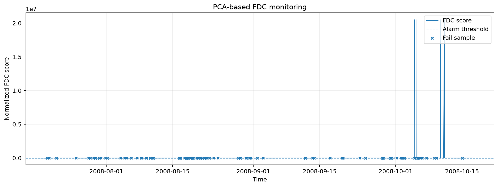
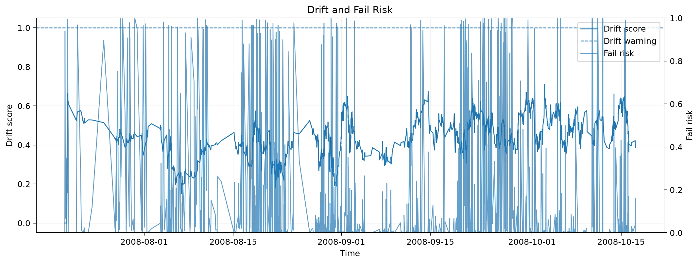
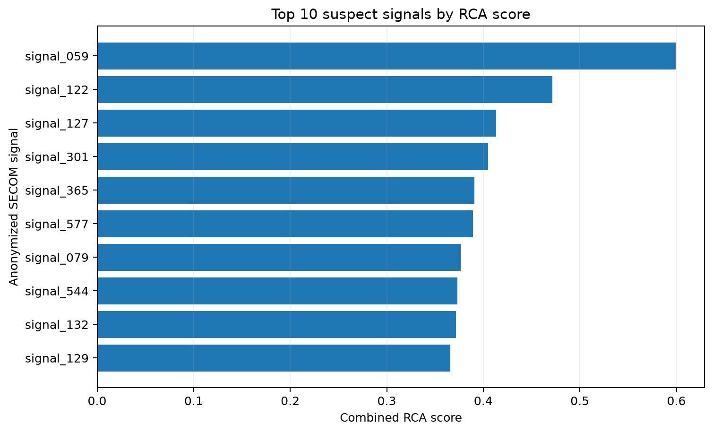
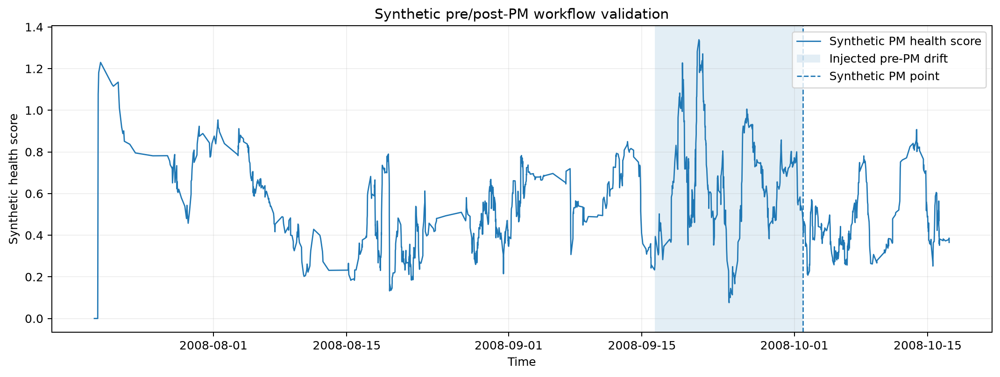

# Semiconductor Equipment FDC & Root Cause Analytics

반도체 공정 센서 데이터를 이용해 **장비 상태 변화와 이상 징후를 탐지하고, Yield Fail과 관련된 원인 후보 신호를 좁혀가는 프로젝트**입니다.

제가 기존에 진행해 온 연구는 저비용 센서의 측정 오차를 줄이는 Sensor Calibration이 중심이었습니다. 센서별 편차뿐 아니라 시간에 따른 drift, 위치가 달라졌을 때의 분포 변화, 문과 창문 개폐 같은 환경 변화에 따른 shift를 다뤘습니다.

이번 프로젝트에서는 이 경험을 반도체 장비 데이터로 확장했습니다. 센서 값을 보정하는 것에서 끝나는 것이 아니라 **정상 상태를 정의하고, 상태 변화를 조기에 찾고, Yield Fail과 관련된 signal을 좁혀 실제 엔지니어가 확인할 항목으로 정리하는 흐름**을 구현했습니다.

```text
Process / Sensor Signals
        │
        ▼
Data Quality Check
        │
        ▼
Pass-only Normal Baseline
        │
        ├── PCA FDC : Hotelling T² / SPE(Q)
        ├── Rolling Drift Detection
        ├── Yield Fail Risk
        └── Root Cause Candidate Ranking
                         │
                         ▼
              Engineering Action / Report
```

## 왜 이 프로젝트를 했는가

기존 센서 보정 연구와 반도체 장비 분석은 도메인은 다르지만 문제 구조가 비슷하다고 생각했습니다.

센서 보정에서는 현재 측정값이 기준 상태에서 얼마나 벗어났는지, 그 변화가 일시적인 노이즈인지 시간에 따른 drift인지 구분해야 합니다. 반도체 장비에서도 여러 공정 신호의 정상 상태를 먼저 정의하고 이후 나타나는 multivariate shift와 이상을 찾아야 합니다.

차이는 분석의 끝입니다. 기존 연구에서는 보정 오차를 줄이는 것이 주된 목표였다면, 여기서는 **이상 발생 여부 → 어떤 signal이 의심되는지 → 무엇을 먼저 확인할지**까지 연결해 보려고 했습니다.

| 기존 센서 보정 연구 | 이번 프로젝트 |
| --- | --- |
| Sensor Calibration | Equipment Health Monitoring |
| 시간에 따른 Sensor Drift | Process Drift / Early Warning |
| 위치 및 환경 변화에 따른 Distribution Shift | Normal Operating Space 이탈 탐지 |
| RMSE 기반 보정 성능 평가 | FDC / Yield 지표 분석 |
| 경량 모델 및 Edge 적용 | 해석 가능한 PCA / 통계 기반 분석 |
| 모델 성능 개선 | Root Cause Candidate와 Engineering Action |

즉, 기존 연구가 **센서 데이터의 신뢰성을 높이는 문제**였다면 이번 프로젝트는 그 데이터를 이용해 **장비 상태를 판단하고 문제의 원인 후보를 좁혀가는 문제**로 확장한 것입니다.

## Dataset

[UCI SECOM](https://archive.ics.uci.edu/dataset/179/secom) 데이터를 사용했습니다.

- 1,567 samples
- 실제 로드 기준 590개의 익명화된 process/sensor signals
- Pass 1,463건 / Fail 104건
- Fail 비율 6.64%
- Timestamp 포함
- `-1 = Pass`, `1 = Fail`
- 결측치 포함

SECOM의 signal 이름은 익명화되어 있습니다. 따라서 `signal_059`가 압력이나 RF Power 같은 특정 물리량이라고 임의로 해석하지 않았습니다. 이 프로젝트에서 RCA 결과는 **실제 고장 원인의 확정값이 아니라 우선 확인할 suspect signal 후보**입니다.

## 분석 방법

### 1. Data Quality & Preprocessing

590개 signal을 바로 모델에 넣지 않고 먼저 데이터 품질을 확인했습니다.

- Missing ratio 확인
- Constant signal 제거
- Train 구간의 median으로 결측치 보간
- 상관관계가 지나치게 높은 중복 signal 제거
- 시간 순서를 유지한 Train / Validation / Test 분할

최종적으로 **590개 signal 중 321개를 분석에 사용**했습니다.

데이터는 60 / 20 / 20으로 시간 순서대로 나눴습니다. Random split을 사용해 성능을 높여 보이기보다, 이후 시점의 정보가 이전 baseline 구축에 들어가지 않도록 chronological split을 유지했습니다.

### 2. PCA-based FDC

정상으로 판정된 Train 구간의 Pass sample만 이용해 Normal Operating Space를 만들었습니다.

PCA는 95%의 설명 분산을 기준으로 **155개 component**가 선택됐고, 다음 두 지표를 FDC에 사용했습니다.

- **Hotelling T²**: 정상 PCA 공간 안에서 평소와 다른 방향으로 이동했는지 확인
- **SPE / Q-statistic**: 정상 PCA 공간으로 설명되지 않는 residual이 증가했는지 확인

정상 Train 구간의 99 percentile을 threshold로 두고 T² 또는 Q가 기준을 넘으면 FDC alarm으로 판단했습니다.



전체 구간에서 FDC alarm 비율은 **28.0%**였습니다. 이 수치는 Fail 적중률을 의미하지 않습니다. 초반 Train 구간으로 만든 정상 baseline과 이후 공정 상태 사이에 어느 정도의 분포 변화가 존재한다는 의미로 보고, 아래 Drift 분석과 함께 확인했습니다.

### 3. Drift Detection

이 부분은 기존 센서 보정 연구와 가장 직접적으로 연결됩니다.

PCA loading이 큰 주요 signal을 대상으로 정상 Pass 구간과 비교해 rolling mean과 variance 변화를 계산했습니다.

```text
Normal baseline
      ↓
Rolling mean shift
Rolling variance shift
      ↓
Drift score
      ↓
Warning candidate
```



기존 연구에서는 drift가 보정 성능을 떨어뜨리는 원인이었다면, 여기서는 **장비 또는 공정 상태가 기존 정상 조건과 달라지고 있다는 조기 신호**로 해석했습니다.

### 4. Yield Fail Risk

Fail 비율이 6.64%로 낮기 때문에 class-balanced Logistic Regression을 사용했습니다. 복잡한 모델로 Accuracy를 높이는 것보다 어떤 signal이 예측에 영향을 주는지 함께 확인할 수 있는 구조를 우선했습니다.

시간 순 Test 결과는 다음과 같습니다.

| Metric | Test |
| --- | ---: |
| Balanced Accuracy | 0.480 |
| Average Precision | 0.068 |
| ROC-AUC | 0.581 |

성능이 높다고 보기 어렵습니다. 특히 chronological split에서 일반화 성능이 제한적이었기 때문에 **Yield Fail Risk를 이 프로젝트의 주 결과로 해석하지 않았습니다.**

오히려 이 결과를 통해 SECOM처럼 Fail sample이 적고 시점에 따른 분포 차이가 있는 데이터에서는 단순 분류 성능보다 정상 상태 변화와 원인 후보를 함께 보는 것이 필요하다고 판단했습니다. 따라서 Fail Risk는 FDC와 RCA를 보조하는 지표로 사용했습니다.

### 5. Root Cause Candidate Analysis

이 프로젝트에서 가장 중요하게 본 부분입니다.

Fail을 맞히는 모델만 만드는 것이 아니라 **문제가 생겼을 때 어떤 signal부터 확인할 것인지**를 정리했습니다.

각 signal에 대해 다음 정보를 함께 사용했습니다.

- Pass / Fail effect size
- Mutual Information
- Logistic Regression coefficient
- Permutation Importance
- PCA residual contribution
- PCA loading importance

한 가지 feature importance만으로 원인을 단정하지 않고 여러 분석 결과가 반복해서 지목하는 signal을 우선순위화했습니다.



현재 결과에서 상위 후보는 다음과 같습니다.

| Rank | Signal | RCA Score |
| ---: | --- | ---: |
| 1 | `signal_059` | 0.5993 |
| 2 | `signal_122` | 0.4716 |
| 3 | `signal_127` | 0.4133 |
| 4 | `signal_301` | 0.4051 |
| 5 | `signal_365` | 0.3906 |

이 signal들이 실제 물리적 고장 원인이라는 의미는 아닙니다. 실제 장비라면 여기서 Tool, Chamber, Recipe, Alarm, PM history와 연결해 원인을 확인해야 합니다. 이 프로젝트에서는 그 전 단계인 **분석상 먼저 확인할 signal을 좁히는 것**까지 구현했습니다.

### 6. Synthetic PM Scenario

SECOM에는 실제 Preventive Maintenance 시점 정보가 없습니다. 그래서 없는 PM 이력을 실제 데이터처럼 만들지 않고, 분석 방법을 검증하기 위한 **Synthetic Scenario**를 별도로 구성했습니다.

Top suspect signal 일부에 일정 기간 offset과 variance 변화를 넣고, PM을 수행했다고 가정한 시점 이후 원래 baseline으로 돌아오도록 만들었습니다.

```text
Baseline
   ↓
Signal Drift 증가
   ↓
Synthetic PM
   ↓
Baseline Recovery
```



이 실험은 PM 효과 자체를 주장하기 위한 것이 아닙니다. 실제 장비 데이터에 PM 이력이 주어졌을 때 **PM 전후 상태를 어떻게 비교하고 회복 여부를 확인할 것인지** 분석 흐름을 구현한 것입니다.

## 결과 요약

| 항목 | 결과 |
| --- | ---: |
| 전체 Sample | 1,567 |
| Raw Signals | 590 |
| 전처리 후 Signals | 321 |
| PCA Components | 155 |
| PCA Explained Variance | 95.0% |
| Fail Rate | 6.64% |
| FDC Alarm Rate | 28.0% |
| Test ROC-AUC | 0.581 |
| Top RCA Candidate | `signal_059` |

분석 결과와 README 이미지는 수작업으로 따로 만든 것이 아니라 아래 명령으로 다시 생성할 수 있습니다.

```bash
python run_pipeline.py
python scripts/generate_readme_figures.py
```

생성되는 결과는 `docs/results/`에도 저장됩니다.

```text
docs/results/
├── metrics.json
├── rca_top20.csv
└── result_summary_ko.md
```

## Dashboard

분석 결과를 한 화면에서 확인할 수 있도록 Streamlit Dashboard도 구성했습니다.

```bash
streamlit run app.py
```

Dashboard에서는 Equipment Health, T²/Q 기반 FDC, Drift, Fail Risk, RCA 후보, Synthetic PM 결과와 Engineering Report를 확인할 수 있습니다.

## Repository Structure

```text
.
├── app.py
├── run_pipeline.py
├── scripts/
│   └── generate_readme_figures.py
├── data/raw/
├── docs/
│   ├── images/
│   └── results/
├── outputs/
├── src/fdc_analytics/
│   ├── data.py
│   ├── preprocessing.py
│   ├── fdc.py
│   ├── drift.py
│   ├── rca.py
│   ├── pm_scenario.py
│   ├── reporting.py
│   └── pipeline.py
└── tests/
    └── test_core.py
```

## 실행 방법

```bash
python -m venv .venv
source .venv/bin/activate        # Windows: .venv\Scripts\activate
pip install -r requirements.txt

python run_pipeline.py
python scripts/generate_readme_figures.py
streamlit run app.py
```

`python run_pipeline.py` 실행 시 `data/raw/`에 데이터가 없으면 UCI SECOM 데이터를 자동으로 다운로드합니다.

## 기존 연구와 연결되는 부분

이 프로젝트를 별개의 반도체 ML 프로젝트로 만들고 싶지는 않았습니다.

제가 진행해 온 센서 보정 연구에서는 저비용 센서와 기준 센서 사이의 오차를 학습하고, 위치가 바뀌거나 시간이 지나도 보정 성능이 유지되는지를 검증했습니다. 실내 5개 위치에서의 spatial shift, 장기간 측정에 따른 drift, 환경 이벤트에 따른 변화도 함께 다뤘고, 저사양 장치에 적용하기 위한 경량 모델과 Edge 환경도 연구했습니다.

그 과정에서 계속 다룬 문제는 결국 **센서 값이 언제부터 기존 상태와 달라졌는지, 그 변화가 일시적인지 지속적인지, 여러 신호 중 어떤 변화가 중요한지 판단하는 것**이었습니다.

이번 프로젝트에서는 그 문제를 반도체 장비 관점으로 옮겼습니다.

```text
Sensor Reliability
      ↓
Sensor Calibration
      ↓
Drift / Distribution Shift
      ↓
Equipment Health Monitoring
      ↓
FDC / Early Warning
      ↓
Root Cause Candidate
      ↓
Engineering Action
```

새로운 Transformer나 복잡한 딥러닝 모델을 추가하는 대신 PCA와 통계 기반 분석을 중심으로 구성한 이유도 같습니다. 이 프로젝트에서 보여주고 싶었던 것은 모델 자체보다 **센서 데이터를 기준 상태와 비교하고, 이상을 찾고, 원인 후보를 좁혀 실제 점검 흐름으로 연결할 수 있다는 점**입니다.

## Limitations

- SECOM signal은 익명화되어 있어 실제 공정 변수의 물리적 의미를 확인할 수 없습니다.
- 각 sample은 생산 entity의 측정값이며 실제 장비의 고주파 waveform이나 OES spectrum은 아닙니다.
- FDC threshold는 본 데이터의 정상 Train baseline에서 설정한 값으로 실제 양산 장비 관리 기준이 아닙니다.
- Yield Fail 분류 성능이 제한적이므로 Fail Risk는 보조 지표로 사용했습니다.
- PM 분석은 workflow 검증을 위한 synthetic scenario입니다.
- 실제 적용 시 Tool, Chamber, Recipe, Lot, Alarm, PM, Metrology 정보가 함께 필요합니다.

## Dataset Citation

McCann, M. & Johnston, A. (2008). **SECOM**. UCI Machine Learning Repository.  
DOI: `10.24432/C54305`
