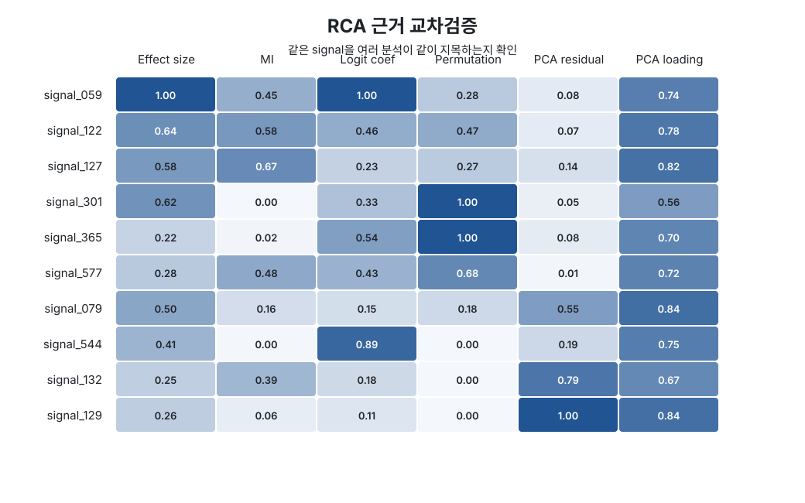

# Semiconductor Equipment FDC & Root Cause Analytics

UCI SECOM 반도체 공정 데이터를 이용해 정상 상태를 만들고, 공정 신호가 정상 범위를 벗어나는 시점을 찾은 뒤 Fail과 관련된 signal을 좁혀가는 프로젝트입니다.

분류 모델의 정확도를 높이는 것보다 다음 흐름을 하나로 연결하는 데 초점을 맞췄습니다.

```text
Data Quality
    ↓
Pass-only Normal Baseline
    ↓
PCA FDC
    ↓
Drift Detection
    ↓
Fail Risk
    ↓
RCA Candidate
```

## 왜 만들었나

석사과정에서 저비용 센서 보정 연구를 진행하면서 계속 다룬 문제는 "센서 값이 기준 상태에서 언제부터 달라졌는가"였습니다.

저비용 센서와 reference sensor의 오차를 줄이는 것뿐 아니라, 측정 위치가 달라졌을 때의 spatial shift, 장기간 측정에서 발생하는 drift, 문과 창문 개폐 같은 환경 변화에 따른 distribution shift도 함께 확인했습니다.

반도체 장비 데이터도 문제를 보는 순서는 비슷하다고 생각했습니다. 먼저 정상 상태를 정의하고, 이후 여러 signal이 정상 상태에서 얼마나 벗어나는지 확인한 뒤, 이상이 발생했을 때 어떤 signal을 먼저 봐야 하는지 좁혀가는 방식입니다.

기존 연구의 Sensor Calibration과 Drift 분석 경험을 반도체 공정의 FDC와 RCA 문제로 확장한 것이 이 프로젝트의 출발점입니다.

## Dataset

[UCI SECOM](https://archive.ics.uci.edu/dataset/179/secom)을 사용했습니다.

| 항목 | 값 |
| --- | ---: |
| Sample | 1,567 |
| Process / Sensor Signal | 590 |
| Pass | 1,463 |
| Fail | 104 |
| Fail 비율 | 6.64% |

SECOM 변수명은 익명화되어 있습니다. 따라서 `signal_059` 같은 변수를 압력이나 온도 등 특정 물리량으로 임의 해석하지 않았습니다.

이 프로젝트의 RCA 결과는 실제 고장 원인을 확정하는 값이 아니라, 분석 결과상 먼저 확인할 signal 후보입니다.

## 1. 전처리

데이터는 시간 순서대로 Train 60%, Validation 20%, Test 20%로 나눴습니다.

Random split을 사용하지 않은 이유는 이후 시점의 정보를 앞선 정상 baseline을 만드는 데 사용하지 않기 위해서입니다.

Train 구간을 기준으로 다음 전처리를 적용했습니다.

- 결측 비율 40% 초과 signal 제거
- 값이 변하지 않는 constant signal 제거
- Train median으로 결측치 보간
- 상관계수 0.98을 초과하는 중복 signal 제거
- Standard Scaling

590개 signal 중 321개가 최종 분석에 사용됐습니다.

## 2. PCA 기반 FDC

Train 구간의 Pass sample만 사용해 Normal Operating Space를 만들었습니다.

PCA는 누적 설명 분산 95%를 기준으로 구성했고, 현재 실행 결과에서는 155개 component가 선택됐습니다.

FDC에는 두 지표를 사용했습니다.

- Hotelling T²: 정상 PCA 공간 안에서 평소와 다른 방향으로 얼마나 이동했는지 확인
- SPE(Q): 정상 PCA 공간으로 설명되지 않는 오차가 얼마나 커졌는지 확인

Train Pass 구간의 99 percentile을 threshold로 사용했습니다.


현재 전체 구간의 FDC alarm 비율은 약 28%입니다.

이 값은 Fail 적중률이 아닙니다. 초반 Train 구간에서 만든 정상 상태와 이후 공정 상태 사이에 변화가 있었던 비율로 보고, Drift와 RCA 결과를 같이 확인했습니다.

## 3. Drift Detection

Drift는 제가 기존 센서 보정 연구에서 가장 많이 다뤘던 부분입니다.

PCA loading이 큰 signal을 대상으로 정상 Pass 구간과 비교해 rolling mean과 rolling variance의 변화를 계산했습니다.

```text
Pass Baseline
    ↓
Mean Shift + Variance Shift
    ↓
Drift Score
```


센서 보정 연구에서는 drift가 calibration error를 증가시키는 원인이었다면, 여기서는 공정 상태가 기존 정상 조건에서 서서히 달라지고 있는지를 보는 지표로 사용했습니다.

## 4. Fail Risk

Fail sample이 104건으로 적기 때문에 class-balanced Logistic Regression을 사용했습니다.

복잡한 모델을 추가하기보다는 RCA에서 coefficient를 직접 확인할 수 있는 모델을 선택했습니다.

현재 시간 순 Test 결과는 다음과 같습니다.

| Metric | Test |
| --- | ---: |
| Balanced Accuracy | 0.480 |
| Average Precision | 0.068 |
| ROC-AUC | 0.581 |

분류 성능은 높지 않습니다.

이 결과를 숨기거나 Random split으로 숫자를 높이기보다, Fail Risk를 최종 판단값이 아닌 보조 지표로 사용했습니다. 이 프로젝트에서 더 중요하게 본 것은 정상 상태 변화와 RCA 후보를 같은 흐름에서 확인하는 것입니다.

## 5. Root Cause Candidate

이상이 발생했다는 것만 확인하면 실제 점검으로 이어지기 어렵기 때문에, 어떤 signal을 먼저 확인할지 순위를 만들었습니다.

한 가지 feature importance에만 의존하지 않고 다음 6개 근거를 함께 사용했습니다.

- Pass / Fail effect size
- Mutual Information
- Logistic Regression coefficient
- Permutation Importance
- PCA residual contribution
- PCA loading importance

각 값을 0~1 범위로 정규화하고 평균값을 `rca_score`로 사용했습니다.


추가로 각 signal이 여러 분석에서 반복해서 나타나는지도 따로 확인했습니다.



`evidence_count`는 6개 근거 중 정규화 값이 0.5 이상인 항목의 개수입니다.

확률이나 통계적 신뢰도를 의미하는 값은 아닙니다. 특정 signal이 한 가지 지표에서만 크게 나온 것인지, 서로 다른 분석에서도 같이 나타나는지를 빠르게 확인하기 위해 추가했습니다.

이 부분은 센서 연구를 하면서 한 개의 값만 보고 이상을 판단하지 않았던 방식을 그대로 가져온 것입니다.

## 결과 요약

| 항목 | 결과 |
| --- | ---: |
| 전체 Sample | 1,567 |
| Raw Signals | 590 |
| 전처리 후 Signals | 321 |
| PCA Components | 155 |
| PCA Explained Variance | 95.0% |
| Fail Rate | 6.64% |
| FDC Alarm Rate | 28.0% |
| Test ROC-AUC | 0.581 |

RCA 상위 결과는 [docs/results/rca_top20.csv](docs/results/rca_top20.csv)에 저장했습니다.

## 기존 연구와 연결되는 부분

제가 해 온 센서 보정 연구와 이번 프로젝트의 연결은 다음과 같습니다.

| 센서 보정 연구 | 이번 프로젝트 |
| --- | --- |
| Reference sensor 대비 오차 분석 | Pass-only normal baseline |
| 시간에 따른 sensor drift | Process drift |
| 위치 변화에 따른 distribution shift | Normal operating space 이탈 |
| 여러 센서의 변화 비교 | Multivariate FDC |
| 보정 성능 저하 원인 확인 | RCA candidate ranking |

도메인은 달라졌지만 분석의 출발점은 같습니다.

기준 상태를 먼저 만들고, 시간이 지나면서 무엇이 달라졌는지 확인하고, 여러 signal 중 실제로 봐야 할 대상을 좁혀가는 방식입니다.

## Dashboard

```bash
streamlit run app.py
```

Dashboard에서는 다음 내용을 확인할 수 있습니다.

- PCA T² / SPE(Q)
- Drift Score
- Fail Risk
- RCA Candidate
- RCA Evidence

## 실행 방법

```bash
python -m venv .venv
source .venv/bin/activate
pip install -r requirements.txt

python run_pipeline.py
python scripts/generate_readme_figures.py
streamlit run app.py
```

Windows에서는 가상환경 실행 명령을 아래처럼 사용하면 됩니다.

```bash
.venv\Scripts\activate
```

`data/raw/`에 데이터가 없으면 `run_pipeline.py` 실행 시 UCI에서 자동으로 다운로드합니다.

## Repository Structure

```text
.
├── app.py
├── run_pipeline.py
├── scripts/
│   └── generate_readme_figures.py
├── docs/
│   ├── images/
│   └── results/
├── src/fdc_analytics/
│   ├── data.py
│   ├── preprocessing.py
│   ├── fdc.py
│   ├── drift.py
│   ├── rca.py
│   └── pipeline.py
└── tests/
    └── test_core.py
```

## Limitations

- SECOM 변수는 익명화되어 있어 실제 물리적 공정 변수와 연결할 수 없습니다.
- Tool, Chamber, Recipe, Alarm, PM 정보가 없어 실제 장비 단위 RCA까지 수행할 수 없습니다.
- FDC threshold는 본 데이터의 Train Pass 구간을 기준으로 잡은 값이며 실제 Fab 관리 기준이 아닙니다.
- Fail sample이 적어 분류 성능이 제한적입니다.
- RCA 결과는 점검 우선순위이며 물리적 원인의 확정값이 아닙니다.

## Dataset

McCann, M. & Johnston, A. (2008). SECOM. UCI Machine Learning Repository.  
DOI: `10.24432/C54305`
